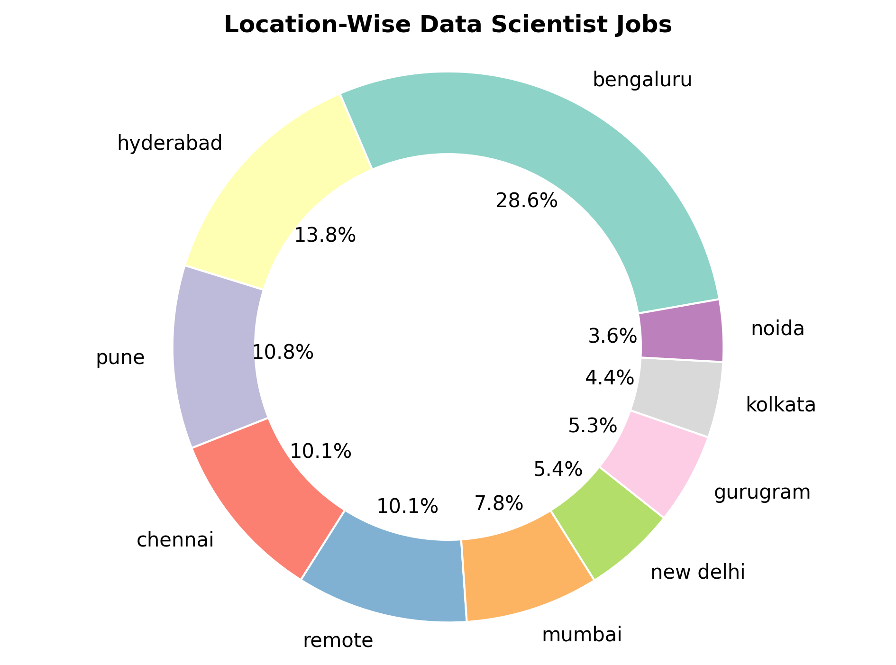
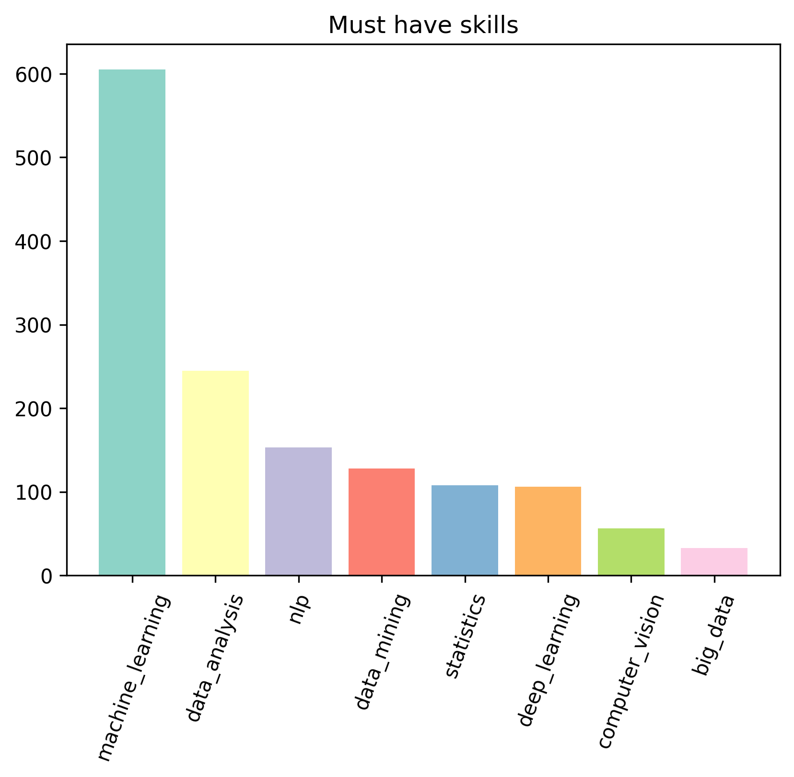
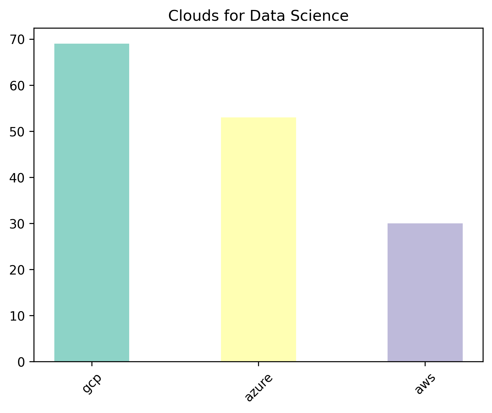
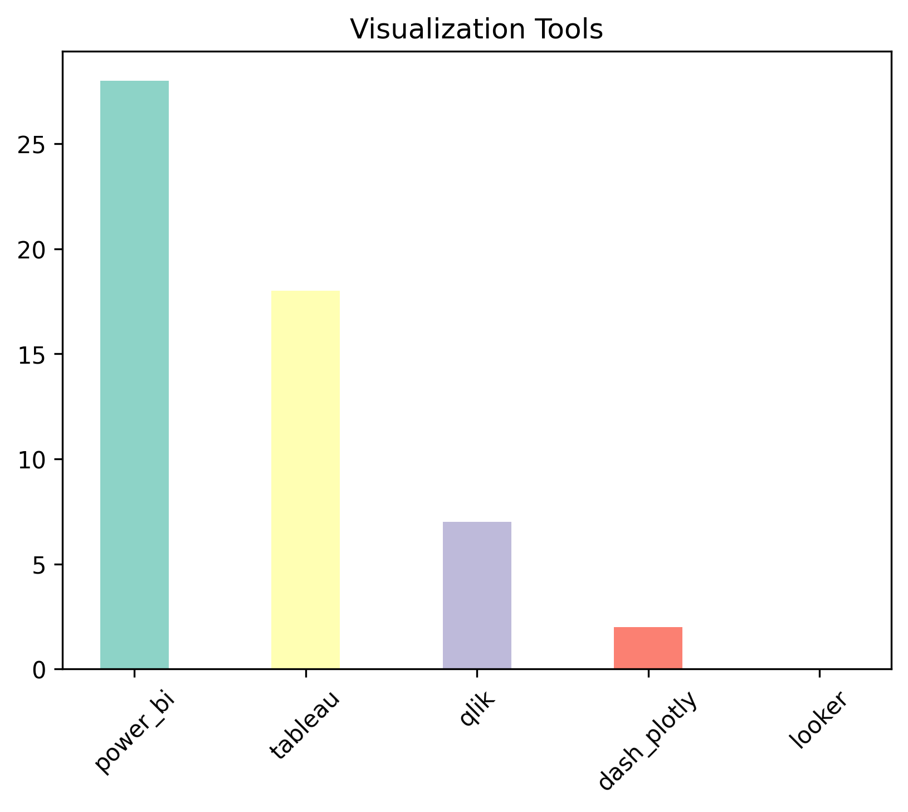
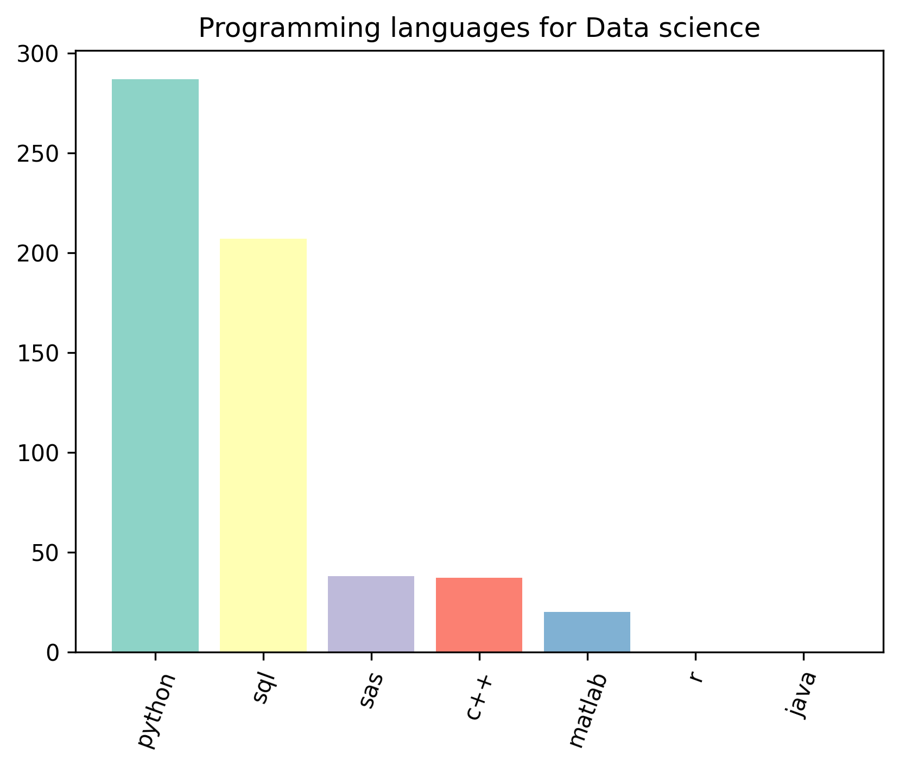

# Data Science Job Market Analysis: Understanding Trends & Skill Demand in India

---

## 🧠 Background and Overview

In today’s competitive job landscape, data science roles are growing rapidly — but so are the expectations. This project analyzes the **Indian data science job market** using web-scraped data from [Naukri.com](https://naukri.com) to uncover:
- Which **cities** offer the most opportunities
- What **skills and tools** are most in demand
- How **job roles** and **experience levels** are distributed

📌 **Business Value**: This analysis helps job seekers align their skill sets with real market demand, and assists recruiters in understanding hiring trends.

---

## 🧾 Data Structure Overview

- **Source**: Web scraped from Naukri.com using Selenium
- **Format**: CSV, with fields like `Job Title`, `Company`, `Location`, `Experience`, `Skills`, etc.
- **Volume**: ~1000 job postings

> 📌 🧾 Data Dictionary

| Column Name        | Description                                         |
|--------------------|-----------------------------------------------------|
| `roles`            | Job title or position (e.g., Data Scientist)        |
| `companies`        | Hiring company name                                 |
| `locations`        | List of job location(s), split if multiple          |
| `experience`       | Required experience level (e.g., 3–5 years)         |
| `skills`           | Comma-separated skills listed in the job posting    |*

---

## 🗂 Executive Summary

| Metric                    | Insight                               |
|--------------------------|----------------------------------------|
| 🔝 Top Job Location       | Bangalore (~30% of total listings)     |
| 👨‍💼 Experience In Demand | 3–6 years (mid-senior roles preferred) |
| 🧪 Top Skill             | Python, SQL, Machine Learning          |
| 📊 Tools in Demand        | Tableau, Power BI                     |

🎯 **Key Takeaway**: Companies are actively hiring **mid-level data professionals** with practical skills in **Python, SQL, and visualization tools**. Deep learning and cloud platforms are gaining relevance.

---

## 🔍 Insights Deep Dive

### 1. 📍 **Location-Based Insights**
- **Top Cities**: Bangalore, Hyderabad, Pune
- Over **50%** of roles are concentrated in top 3 cities

---

### 2. 💼 **Role & Experience Breakdown**
- Majority listings are titled **“Data Scientist”**
- **Mid-senior roles** dominate listings

---

### 3. ⚙️ **Skill Trends**

This subsection explores the most in-demand skills for data science roles based on the job listings.

- 💡 **Core Languages**: Python and SQL dominate as foundational skills.
- 🧠 **Machine Learning & Data Analysis**: Strong demand for ML, statistics, and data manipulation.
- 📊 **Visualization Tools**: Power BI and Tableau stand out for business intelligence roles.
- ☁️ **Cloud Platforms**: GCP and Azure are frequently mentioned across job postings.

<table>
  <tr>
    <td></td>
    <td></td>
  </tr>
  <tr>
    <td><b>Top Technical Skills</b></td>
    <td><b>Cloud & Platform Tools</b></td>
  </tr>
  <tr>
    <td></td>
    <td></td>
  </tr>
  <tr>
    <td><b>Data Visualization Tools</b></td>
    <td><b>Programming Languages</b></td>
  </tr>
</table>

---

## 💡 Recommendations

Based on the analysis, here’s what **job seekers** and **recruiters** can do:

### 👨‍💻 For Aspiring Data Scientists:
- Prioritize mastering **Python**, **SQL**, and one BI tool (e.g., Tableau)
- Gain **3+ years of experience** through internships or freelance work
- Focus job applications on cities like **Bangalore**, **Hyderabad**, **Pune**

### 🧑‍💼 For Recruiters:
- Target candidates with core data stack experience (Python + SQL + BI)
- Emphasize remote opportunities in tier-2 cities to expand the talent pool

---

## 🚀 Streamlit App

🖥️ Try the **interactive dashboard**:
**[👉 Launch the App](https://your-streamlit-url.streamlit.app/)**

---

## 🛠️ Tech Stack

- `Python 3.8`
- `Pandas`, `Matplotlib`, `Sklearn`, `UMAP`
- `Selenium` (Web scraping)
- `Streamlit` (App interface)

---

## ⚠️ Caveats & Limitations

- Data is from a **limited period** and geographic scope (India only)
- Job postings may contain duplicates or vague role descriptions
- Skills may be inconsistently listed (e.g., "ML" vs. "machine learning")

---

## 📁 File Structure

📂 project-root
│
├── 📊 Job_Market_Analysis.ipynb # Main notebook with analysis
├── 🖥️ streamlit_app/
│ ├── Home.py
│ ├── scripts/
│ └── pages/
├── 📷 images/
├── requirements.txt
└── README.md
